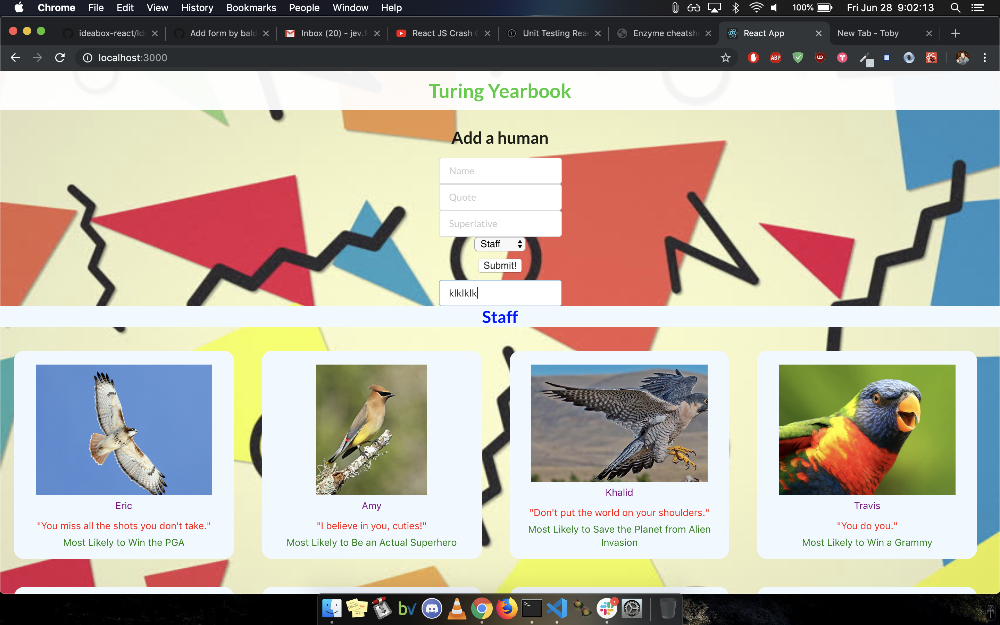
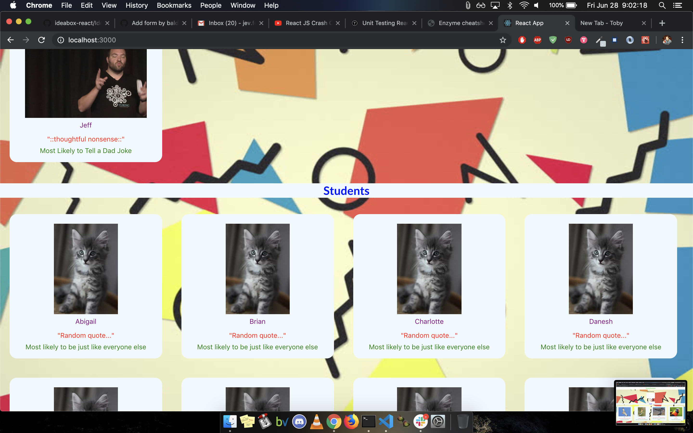

# Yearbook

This is my first attempt to create a functioning yearbook app using the React framework. This app displays both staff and students, their names, quotes, superlatives, etc., and also has the option of adding more students/staff members live and dynamically.

## Getting Started

1. Clone the repo.
2. Set up the dependancies by running `npm install`
3. Enjoy the fake data!

### Prerequisites

You'll need a modern windows, linux, or OS X machine, able to run the dependancies.

## Running the tests

As this is our first React project, the only tests we were asked to set up were snapshots of all our components.

Set up the dependancies by running `npm install`

Run tests by typing `npm test` in your terminal in your cloned directory.

### Goals and Objectives

- Follow the specification [here](http://frontend.turing.io/projects/turing-yearbook.html) to make a working yearbook.
- Implement React components that communicate to each other as needed.
- Take advantage of State, props, and class/functional components.
- Write modular, reusable code that attempts to adhere to the following principles: the Open/Closed Principle, Liskov Substitution Principle, Interface Segregation Principle, Dependency Inversion Principle, and Test Driven Development.
- Use object and array prototype methods to perform rich data manipulation.

## Author

**Jev Forsberg** - *All work* - [baldm0mma](https://github.com/baldm0mma)

## License

This project is licensed under the MIT License - see the [LICENSE.md](LICENSE.md) file for details.